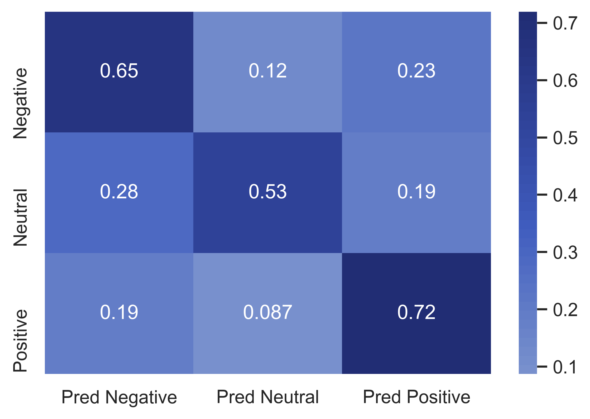

# NLP_Tweet_Sentiment_Analysis

image courtesy of Ady Teenagerinro and unsplash

### What's the Buzz?
Many companies want to keep track of public sentiment about various products.  Positive sentiment might drive production for creators or inventory management for retailers.  It might drive the attention of influencers, news organizations, and consumers.  Twitter is a platform where individuals and companies express themselves and have conversations and is full of information about how people feel about particular products.

We four intrepid data scientists, as a project for our data science intensive bootcamp through Flatiron school, set out to create a model that could determine how people feel about products or brands through their tweets. Twitter is gold mine of emotional sentiment, as users impulsively express themselves in short, terse terms. Tweets about given products are easy to collect as users use hashtags to communicate the topics of their expression.

We created a model when given a tweet or series of tweets and a product would determine how the user felt about that product. This is trivial for a human to accomplish, but our model can do this for thousands or even millions of tweets in a small amount of time.

This is not a trival problem. Twitterspeak is rife with spelling errors, shortened words, acronyms, hashtags, and very specific words and proper nouns. These are hard or impossible for a model to learn and are even confusing for humans much of the time. Emotions are also complicated and a tweet may have a mix of emotions, ambiguous emotions, or conditional emotions. The spectrum of feeling is much greater than our categories of positive, negative, or neutral.

Emotions are also relative. Consier the phrase, "iPhones are better than Android phones." Is this a positive or a negative tweet? It depends! This is why we chose to give our model a clue to which product we want the emotions to be classified in reference to. We used the product name supplied in the 'product' column of our table to replace instances of that product in the tweet test with 'targetproduct'. This helped our model to contextualize emotions and deal with this relativity.

A model only learns as well as it's labels, and our data was labeled by humans. Each human may have a different interpretation of a tweet. The data was most likely labeled by different humans, and so there may be different opinions about the emotional context of a tweet expressed by different human labelers.

These considerations make this problem particularly sticky, and we are proud of the success that our models had in decifering the tweets. As is often true with NLP problems, the structure of the model is often less important than how the data is prepared.

We tried many different approaches to this problem, from recurrent neural networks to convolutional neural networks, to a simple logistic regression model. Each used model approached the problem in a different way, but they all were able to classify over 3/5ths of tweets correctly, giving a client a general sense, over a large sampling of tweets, what the sentiment is about their product in the twitterverse.

# The Data

We trained our model using 3 datasets hosted on data.world's [Crowdflower](https://data.world/crowdflower): 

* The Brands and Product Emotions dataset 

* The Deflategate Sentiment dataset

* The Coachella-2015 dataset

# Andrew add more here

# The Models
We explored 3 very different model architectures: shallow models, convolutional neural networks, and recurrent neural networks.

## Shallow Models

# Elena Add More Here

## Convolutional Neural Networks

# Matt Add More Here

## Recurrent Neural Networks.

We began with a rather simple RNN using a trainable embedding layer followed by a long-short term memory layer, a max pooling layer to process the sequence data from the LSTM, a densely connected layer and finally a smaller dense output layer.  This model performed reasonably well, achieving a 62% accuracy on the validation data.

We also explored using pretrained GloVe Embeddings1 rather than a trainable embedding layer, but because so much of the vocabulary from our dataset was nonstandard English, the GloVe dictionary, though massive woulc only encode about 2/3rds of it.  The model lost too much information from the tweets to be able to perform well.  We also tried initializing the embedding layer with the GloVe embeddings and then letting train from there, but this also gave disappointing results.

The change that did end up making some difference was to make the LSTM layer both smaller (from 25 neurons to 5 neurons) and to make it bidirectional so it read the tweets both forward and backward at the same time.  The bidirectionality combined with the memory of the LSTM's memory cell allowed the model to read words both in the context of the words that came before them, but also in the context of words that came after.  This is similar to how humans read, retroactively contextualizing what they have read based on what they read later.

The final LSTM model was actually simpler than the first simple model:

These changes raised the accuracy from 62% to 64.5% with a reasonable distribution of errors across classes.  It did somewhat better on positive emotion labeled tweets, and tended to miscategorize neutral tweets as negative.  This ended up being as much accuracy as we could squeeze out of this style of model.

If you want to learn more about this type of model, please refer to [this excellent article](https://medium.com/@raghavaggarwal0089/bi-lstm-bc3d68da8bd0) by Raghav Aggerwal.
# Summary

We created a model that can label tweets about a specific product with 67% accuracy.  This can be used, in conjunction with a twitter crawler to pick tweets related to a brand or product, to determine how positively or negatively a specific product is being regarded in the Twitterverse during a specific timeframe.  The best model we made was also the simplest, fastest, and least computationally demanding, a logistic regression model.  However we used a lot of preprocessing to achieve this success.  We focused the model on the target product by replacing the product name with 'targetproduct', tokenized and lemmatized the words to boil them down into their basic meanings, and then vectorized them using a count vectorizer to index them by how commonly they show up.  The model used this heavily processed version of the tweets to determine their emotional content.

# Going Forward:

Future researchers might explore better ways to lemmatize and prepare twitterspeak to be more semantically accessible to predictive models. They also might try using other kinds of neural networks, such a gated recurrent unit models or simpler densely connected feed forward models.  While complex deep learning solutions may improve on our work, it's also possible that tweets can best be classified using 'bag of words' style modeling.  In this case the specifics of word encoding might be what makes the difference and using GloVe embeddings to encode words for a shallow model could be productive.

# References:

1Jeffrey Pennington, Richard Socher, and Christopher D. Manning. 2014. [GloVe: Global Vectors for Word Representation](https://nlp.stanford.edu/pubs/glove.pdf). [pdf] [bib]

